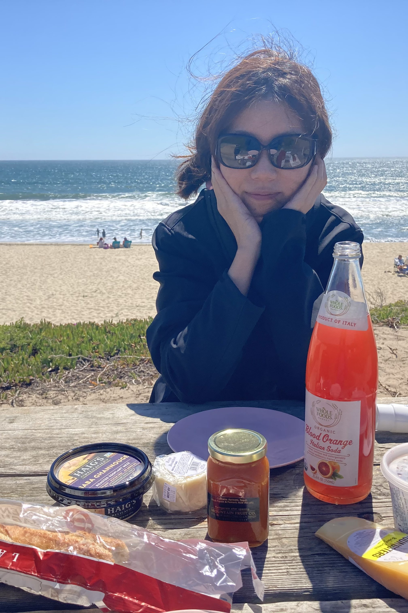
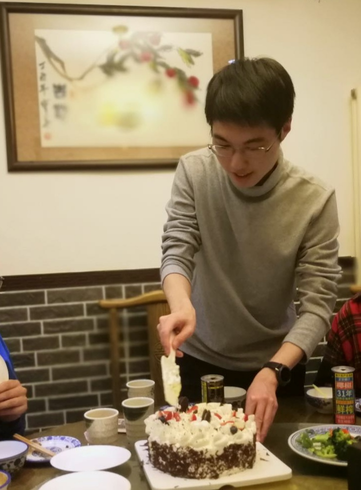
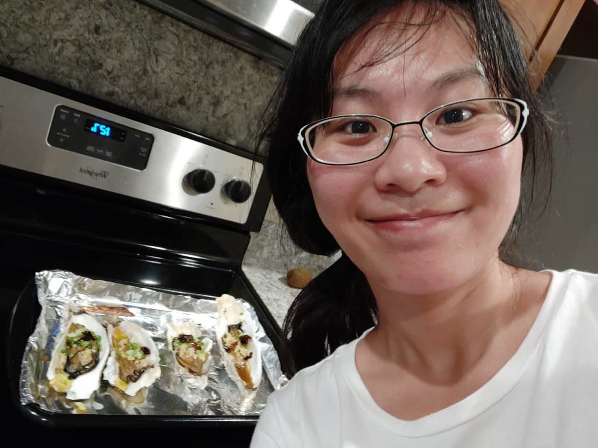

# Q Ore

Q Ore leverages quantum power to speedup open pit mining algorithms.

[Project Theme Document](https://github.com/cs210/IBM-QC-Open-Pit-Mining/blob/main/IBM-Quantum-OpenPitMining-v2.pdf)

[Team Song](https://youtu.be/Lyu7-Jcyl_8)

[Code Repository]() TBD

# Team Members
Member | Email | Photo
--- | --- | ---
Xuxin Huang | xxhuang@stanford.edu |   
Tianyi Hao | tianyih@stanford.edu |  
Chunjing Jia | chunjing@stanford.edu | 
Cheng Peng | cpeng18@stanford.edu | 

# Team Skills Matrix:

Member | Skills | Personal Traits | Desired Growth | Weaknesses
--- | --- | --- | --- | ---
Xuxin | Python, C++, quantum physics | logical, motivated, flexible, optimistic, chill | Quantum algorithms and project management | Project management 
Tianyi | Python, quantum simulation, tensor algebra | O: curious, C: organized, E: reserved, A: neutral, N: sensitive | Deeper understanding of quantum algorithms | Time management 
Chunjing | Python, C++, quantum physics | motivated, curious, agreeable, flexible | implementation of quantum algorithms, project management | self-criticism
Cheng　｜　Matlab, C++, tensor algorithms, quantum physics　｜　Learner, inquisitive, ideation, collaborative　｜　Language skills

# Team Communication:
1. Email/Slack: TBD

3. Documentation: [Github Wiki](https://github.com/cs210/IBM-QC-Open-Pit-Mining/wiki).

4. Calendar: TBD
